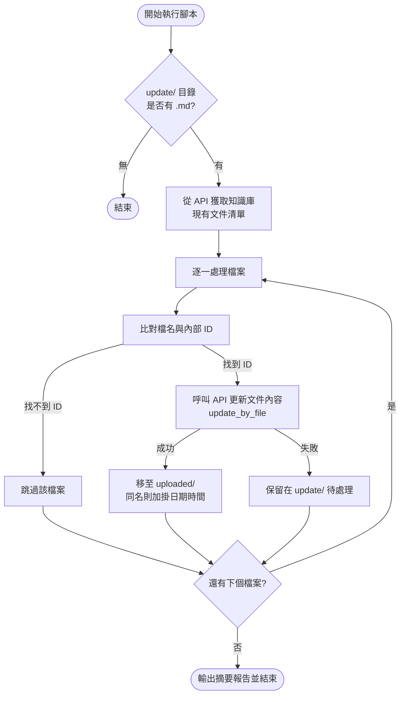

# Dify 知識庫自動更新工具 (tsc_KM)

本工具用於自動將本地 `update/` 目錄下的 Markdown 文件更新至指定的 Dify 知識庫（Dataset）中。透過 API 自動比對檔名並獲取 Document ID，實現單份或多份文件的批次更新，並在成功的同時自動歸檔。

---

## 🛠 目錄結構

```text
tsc_KM/
├── update/             # 待更新目錄：放置新的 .md 檔案（檔名須與知識庫內一致）
├── uploaded/           # 歸檔目錄：上傳成功的文件會移至此，若同名會自動加上時間戳
├── update_knowledge.py # 主程式：自動化更新腳本
├── .env                # 配置設定：存放 API Key 與 Dataset ID
└── README.md           # 本文件
```

---

## ⚙️ 環境配置 (.env)

請確保 `tsc_KM/.env` 檔案內容正確：

```ini
DIFY_API_KEY=dataset-xxxxx...   # 來自 Dify 設定 -> API 密鑰
DIFY_BASE_URL=http://localhost:8080
DATASET_ID=3296d37b-804b...     # 知識庫的 UUID
```

---

## 🔄 作業流程圖



---

## 📖 Dify API 更新原理說明

要透過 API 更新 Dify 知識庫中的特定文件，需遵循以下兩個主要步驟。由於一個知識庫可能包含多份文件，API 操作是基於 **Document ID**（UUID 格式）而非純檔名。

### 步驟 1：取得目標文件的 `document_id`
首先查詢該知識庫的文件列表，從中找出對應檔名的 ID。
*   **端點**：`GET /v1/datasets/{dataset_id}/documents`
*   **目的**：比對 JSON 回傳內容中的 `name`，取得對應的 `id`。

### 步驟 2：執行更新操作
取得 ID 後，透過上傳檔案來覆蓋舊有內容。
*   **端點**：`POST /v1/datasets/{dataset_id}/documents/{document_id}/update_by_file`
*   **參數**：
    *   `file`：新的 Markdown 檔案。
    *   `data`：包含 `indexing_technique`（預設 `high_quality`）與 `process_rule`。

---

## 🚀 使用步驟

1. **準備檔案**：將修改好的 `.md` 檔案放入 `update/` 目錄（注意：檔名必須完全符合 Dify 知識庫中顯示的名稱）。
2. **執行更新**：
   ```powershell
   cd c:\VSCode_Proj\Dify\tsc_KM
   python update_knowledge.py
   ```
3. **檢查結果**：
   - 看到 `[OK] 更新成功！` 表示已完成上傳。
   - 原始檔案會自動從 `update/` 移到 `uploaded/`。

---

## ⚠️ 重要提醒

1.  **API Key 類型**：請務必使用「**知識庫專用 API Key**」（以 `dataset-` 開頭），而非應用程式 API Key。
2.  **分段規則**：更新操作會導致該文件重新進行分段（Segmentation）與索引（Indexing）。若無特殊設定，腳本預設採「自動分段」。
3.  **重新索引**：在高質量模式下，更新後會消耗一定的 Token 進行 Embedding。
4.  **Windows Unicode**：腳本已處理 UTF-8 編碼修正，避免中文檔名上傳發生錯誤。

---

**整理人：** Antigravity AI & Porter
