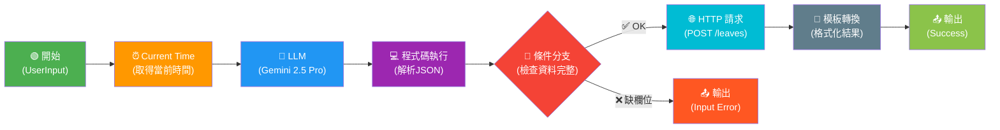

# 請假小幫手 — Workflow 分析與修正報告

> **整理人：** Antigravity AI & Porter  
> **最後更新：** 2026-03-06

---

## 一、Workflow 架構理解

此 Dify 應用為 **Workflow（工作流）** 模式，**非** Chatbot 對話模式。使用者輸入一句自然語言，系統自動解析為結構化請假資料並送出 API。

### 工作流程圖



### 節點功能摘要

| # | 節點 | 功能 | 使用模型/工具 |
|---|------|------|---------------|
| 1 | **開始** | 接收使用者自然語言輸入 | 文字輸入欄位 `UserInput` |
| 2 | **Current Time** | 取得當前時間作為日期計算基準 | Dify 內建 time 工具 |
| 3 | **LLM** | 從自然語言中提取請假資訊→輸出 JSON | Gemini 2.5 Pro |
| 4 | **程式碼執行** | 解析 LLM 輸出的 JSON，檢查欄位完整性 | Python3 腳本 |
| 5 | **條件分支** | 判斷資料是否完整（ok = true/false） | IF/ELSE |
| 6 | **HTTP 請求** | 將請假 JSON POST 到後端 API | POST `http://host.docker.internal:8002/leaves` |
| 7 | **模板轉換** | 將結果格式化為人類可讀的回覆 | Jinja2 模板 |
| 8/9 | **輸出** | 回傳成功結果 / 錯誤訊息 | End 節點 x2 |

### 支援的請假欄位

| 欄位 | 說明 | 必填 |
|------|------|------|
| `category` | 請假類別（事假、病假、特休、補休） | ✅ |
| `duration` | 天數或小時數 | ✅ |
| `duration_type` | `day` 或 `hour` | 自動判斷 |
| `date_start` | 開始時間 (ISO 8601) | 自動計算 |
| `date_end` | 結束時間 (ISO 8601) | 自動計算 |
| `reason` | 請假原因 | 選填 |

---

## 二、發現的問題

### 🔴 嚴重 Bug（影響功能正常運作）

| # | 問題 | 位置 | 影響 |
|---|------|------|------|
| 1 | **條件分支邏輯錯誤** | 條件分支節點 | 檢查 `date_end is "true"`，但 `date_end` 是日期字串如 `"2026-02-24T17:30:00+08:00"`，**永遠不等於** `"true"`，導致所有請假都走到錯誤輸出！應改為 `ok is "true"` |
| 2 | **Current Time 時區設為 UTC** | Current Time 節點 | 台灣時區為 +08:00，但取時間用 UTC，**會差 8 小時**，導致「今天」、「明天」等相對日期計算錯誤 |
| 3 | **Start 預設值完全無關** | 開始節點 | 預設值為 `今天 公園加油站 加油 數量1 金額1000`，這看起來是從別的工作流複製過來的 |
| 4 | **輸出(Input Error) 取錯變數** | 輸出(Input Error) 節點 | 輸出 `程式碼執行.reason` 但錯誤訊息在 `程式碼執行.reply`，使用者會看到空白或無關內容 |

### 🟡 中度問題

| # | 問題 | 影響 |
|---|------|------|
| 5 | **opening_statement 為空** | 使用者看不到任何引導說明 |
| 6 | **suggested_questions 為空** | 沒有範例提示使用者如何輸入 |
| 7 | **System Prompt 中 `{{CURRENT_TIME.result}}` 變數引用可能失效** | Workflow 模式的變數引用格式應使用節點 ID 方式 |
| 8 | **模板轉換輸出格式簡陋** | 成功回覆只有純文字，不夠友善 |

### 🟢 建議改善

| # | 內容 |
|---|------|
| 9 | 缺少「半天假」（上午假/下午假）的支援 |
| 10 | 未考慮連假/週末跳過邏輯 |
| 11 | `suggested_questions_after_answer: false` 可改為 true |

---

## 三、修正內容

### 3.1 修正 #1：條件分支邏輯（🔴 最關鍵）

```diff
  # 條件分支 - 應檢查 "ok" 而非 "date_end"
  conditions:
  - comparison_operator: is
    value: 'true'
    variable_selector:
    - '1771776413866'
-   - date_end
+   - ok
```

### 3.2 修正 #2：Current Time 時區

```diff
  tool_configurations:
    timezone:
      type: constant
-     value: UTC
+     value: Asia/Shanghai
```

> [!NOTE]
> Dify 的 time 工具沒有 `Asia/Taipei` 選項，`Asia/Shanghai` 同為 UTC+8，效果相同。

### 3.3 修正 #3：Start 預設值

```diff
  variables:
- - default: 今天 公園加油站 加油 數量1 金額1000
+ - default: 明天請特休一天，去看醫生
```

### 3.4 修正 #4：輸出(Input Error) 變數

```diff
  # 輸出(Input Error) 節點
  outputs:
  - value_selector:
    - '1771776413866'
-   - reason
+   - reply
```

### 3.5 改善 Opening Statement

```
📋 請假小幫手

我可以幫你快速完成請假申請！只要用自然語言告訴我：
• 請什麼假（事假、病假、特休、補休）
• 請多久（幾天 或 幾小時）
• 什麼時候開始
• 原因（選填）

我會自動幫你計算時間、產生請假單並送出申請 ✨
```

### 3.6 對話開場白建議問題（Suggested Questions）

| # | 建議問題 | 展示重點 |
|---|----------|----------|
| 1 | `明天請特休 1 天，去辦私事` | 最基本用法：日期 + 假別 + 天數 + 原因 |
| 2 | `下週一請病假 3 小時` | 小時模式 + 相對日期 |
| 3 | `今天下午請事假 2 小時，要去銀行` | 當天 + 下午 + 具體原因 |

### 3.7 改善模板轉換（成功回覆）

```
✅ 請假申請已送出！

📋 請假明細：
━━━━━━━━━━━━━━━
假　　別：{{ category }}
時　　長：{{ duration }}
起始時間：{{ date_start }}
結束時間：{{ date_end }}
請假原因：{{ reason }}
━━━━━━━━━━━━━━━

如有問題請洽人事部門 📞
```

### 3.8 改善 System Prompt

主要改善點：
- 修正 `{{CURRENT_TIME.result}}` 引用格式
- 增加「半天假」支援邏輯
- 增加更多假別範例
- 強化錯誤處理指引

```
# 任務
你是一個嚴謹的請假資訊提取工具。請從用戶輸入中提取請假資訊並轉換為 JSON 格式。
不要聊天，不要解釋，只輸出一個 JSON 物件。

# 欄位規範
- category: 請假類別（事假、病假、特休、補休、喪假、婚假、產假、陪產假、公假）
- duration: 請假的天數或小時數（純數字，如 0.5 代表半天）
- duration_type: 單位，固定為 "day" 或 "hour"
- date_start: 請假開始時間，ISO 8601 格式 (YYYY-MM-DDTHH:MM:SS+08:00)
- date_end: 請假結束時間，ISO 8601 格式 (YYYY-MM-DDTHH:MM:SS+08:00)
- reason: 請假原因或備註（選填，無則為 null）
- missing: 缺少的必填欄位列表（檢查 category 和 duration 是否存在）

# 日期計算邏輯（基準時間見 User Prompt）
1. **相對日期**：根據基準時間推算「今天」、「明天」、「下週X」等。
2. **天數模式 (day)**：
   - 未指定時間時，開始固定 09:00:00，結束固定 17:30:00。
   - 半天假：上午假 = 09:00~12:00，下午假 = 13:00~17:30，duration 為 0.5。
   - 1 天 = 同一天；2 天 = 開始日 + 隔天。
3. **小時模式 (hour)**：
   - 未指定開始時間，預設 09:00:00。
   - **午休順延**：若跨 12:00~13:00，結束時間順延 1 小時。
4. 所有時間帶台灣時區 +08:00。

# 範例
Input: "明天想請特休 1 天，去辦事"
Output: {"category": "特休", "duration": 1, "duration_type": "day", "date_start": "2026-02-24T09:00:00+08:00", "date_end": "2026-02-24T17:30:00+08:00", "reason": "去辦事", "missing": []}

Input: "請事假半天"
Output: {"category": "事假", "duration": 0.5, "duration_type": "day", "date_start": "2026-02-23T09:00:00+08:00", "date_end": "2026-02-23T12:00:00+08:00", "reason": null, "missing": []}

Input: "下午要走"
Output: {"category": null, "duration": null, "duration_type": null, "date_start": null, "date_end": null, "reason": null, "missing": ["category", "duration"]}

---
UserInput: {{UserInput}}
```

---

## 四、修正優先順序

> [!WARNING]
> 修正 #1（條件分支邏輯）是**必須立即修復**的 Bug，否則整個工作流完全無法正常運作。

| 優先序 | 修正項目 | 急迫性 |
|--------|----------|--------|
| **P0** | 條件分支：`date_end` → `ok` | 🔴 不修就完全壞掉 |
| **P0** | 輸出(Input Error)：`reason` → `reply` | 🔴 錯誤訊息無法顯示 |
| **P1** | Current Time 時區：UTC → Asia/Shanghai | 🟡 日期計算差 8 小時 |
| **P1** | Start 預設值改為請假範例 | 🟡 避免使用者困惑 |
| **P2** | 加入 Opening Statement 和 Suggested Questions | 🟢 提升使用體驗 |
| **P2** | 美化模板轉換輸出 | 🟢 提升可讀性 |
